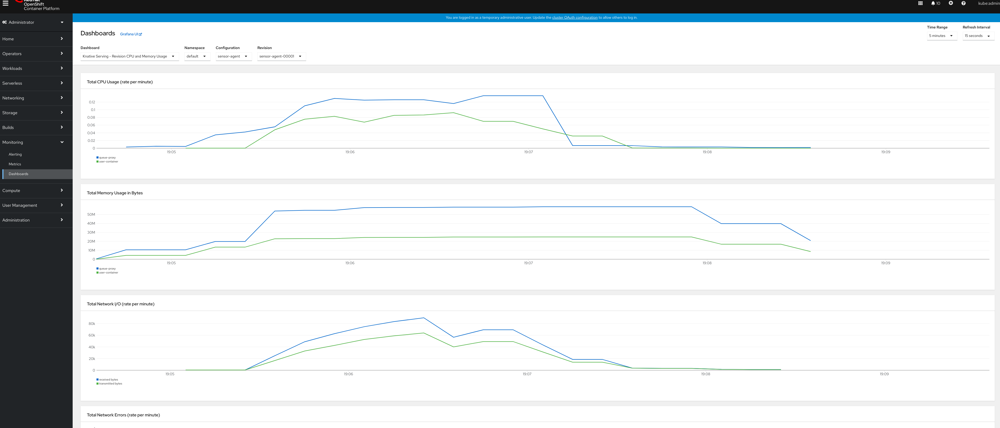
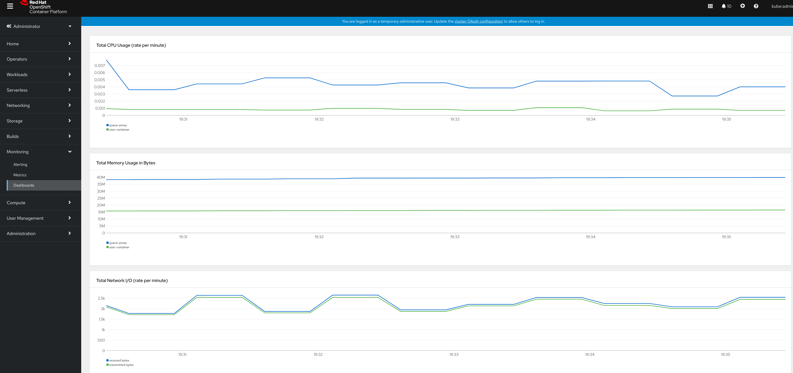

# Scaling Down to zero with Openshift Serverless

## Autoscaling, capacity and containers

[Scaling to zero](https://aws.amazon.com/blogs/publicsector/scaling-zero-serverless-way-future-university-of-york/) is one of the major features of Openshift Serverless.
It is really important wrt cost when the workload is not predictable and when latency is not
the most important objective. For example when the workload is [bursty](https://cacm.acm.org/magazines/2019/12/241054-the-rise-of-serverless-computing/fulltext?mobile=false) we can adapt to it according to
some metric eg. rps (requests per second) and scale resources to the required number of pods.
When there is no traffic or traffic is low then we can actually free resources without worrying
about future peaks. In a typical deployment without Serverless, users (especially outside K8s)
will have to plan for the maximum capacity at all times to keep up with the workload demand.
In general before deploying an app in production, users need to size their containers and
this is done usually by extensive benchmarking or [automatically](https://learnk8s.io/setting-cpu-memory-limits-requests) in certain cases.
A more advanced approach is to optimize [resources at runtime dynamically](https://arxiv.org/pdf/2005.14410.pdf).
When users deploy applications on K8s need also to consider the cluster size and plan for the
capacity required and this can be affected by the workloads to be run but one thing that needs to
be avoided is [having tiny or very large containers](https://cloud.google.com/blog/products/containers-kubernetes/kubernetes-best-practices-resource-requests-and-limits)
and creating resource fragmentation that keeps the cluster not utilized and leading to starvation in some cases.
Note here that capacity management and resource allocation is not an [easy task for humans (np-complete)](https://www.openshift.com/blog/full-cluster-capacity-management-monitoring-openshift).
Next we will show via a demo app the scale down capabilities of Openshift Serverless.

## Setting up the demo application on Openshift

The application receives data via http in json format and ingests data records to kafka.
We use httperf to create a test load that sends data to the application. 
The application is written in GO.

Here are the steps for deploying the app:

0.  Build artifacts

```
docker build --no-cache -t docker.io/skonto/sensor-agent .
docker build -f ./Dockerfile.httperf -t docker.io/skonto/httperf .
docker push docker.io/skonto/sensor-agent 
docker push docker.io/skonto/httperf
```
1. Install the Serverless operator and Strimzi and create the related topics.

```
oc apply -f topics.yaml
```
2. Install the service that will process the messages

```
oc apply -f service.yaml
``` 

3. Install the httpperf job
```
oc apply -f httperf.yaml
```

4. Check that we are getting some real data
   
```
kubectl -n kafka run kafka-consumer -ti --image=quay.io/strimzi/kafka:0.22.1-kafka-2.7.0 --rm=true --restart=Never -- bin/kafka-console-consumer.sh --bootstrap-server my-cluster-kafka-bootstrap.kafka.svc:9092 --topic sensors
If you don't see a command prompt, try pressing enter.
{"id":"xyz","value":2.2,"source_type":"temperature"}
{"id":"xyz","value":2.2,"source_type":"temperature"}
{"id":"xyz","value":2.2,"source_type":"temperature"}
{"id":"xyz","value":2.2,"source_type":"temperature"}
{"id":"xyz","value":2.2,"source_type":"temperature"}
{"id":"xyz","value":2.2,"source_type":"temperature"}
....
``` 

5. The app is being scaled up for the target we have set which is 50 rps per container:

```
oc get pods
NAME                                              READY   STATUS        RESTARTS   AGE                                       0/1     Error         0          106m
httperf-load-ddjm9                                1/1     Running       0          50s
sensor-agent-00001-deployment-5d8c94694c-6ffjw    2/2     Running       0          38s
sensor-agent-00001-deployment-5d8c94694c-f7gn6    2/2     Running       0          40s
sensor-agent-00001-deployment-5d8c94694c-j5pjs    2/2     Running       0          44s

```

6. Benchmark results can be seen as follows:

```
oc logs httperf-load-mbsvm
httperf: warning: open file limit > FD_SETSIZE; limiting max. # of open files to FD_SETSIZE
httperf --timeout=1 --client=0/1 --server=sensor-agent.default.svc --port=80 --uri=/ --rate=100 --send-buffer=4096 --recv-buffer=16384 --add-header='Accept: application/json\nContent-Type: application/json\n' --method=POST --wsesslog=10000,0.000,perf.txt
Maximum connect burst length: 2

Total: connections 10000 requests 10000 replies 9981 test-duration 100.025 s

Connection rate: 100.0 conn/s (10.0 ms/conn, <=78 concurrent connections)
Connection time [ms]: min 2.8 avg 47.7 max 971.7 median 16.5 stddev 97.5
Connection time [ms]: connect 0.0
Connection length [replies/conn]: 1.000

Request rate: 100.0 req/s (10.0 ms/req)
Request size [B]: 208.0

Reply rate [replies/s]: min 90.4 avg 99.8 max 106.0 stddev 2.7 (20 samples)
Reply time [ms]: response 47.7 transfer 0.0
Reply size [B]: header 124.0 content 0.0 footer 0.0 (total 124.0)
Reply status: 1xx=0 2xx=9981 3xx=0 4xx=0 5xx=0

CPU time [s]: user 33.29 system 61.63 (user 33.3% system 61.6% total 94.9%)
Net I/O: 32.5 KB/s (0.3*10^6 bps)

Errors: total 19 client-timo 19 socket-timo 0 connrefused 0 connreset 0
Errors: fd-unavail 0 addrunavail 0 ftab-full 0 other 0

Session rate [sess/s]: min 90.41 avg 99.78 max 106.01 stddev 2.75 (9981/10000)
Session: avg 1.00 connections/session
Session lifetime [s]: 0.0
Session failtime [s]: 1.0
Session length histogram: 19 9981

```

7. After some time pods are scaled to zero.

```
oc get pods
NAME                                              READY   STATUS      RESTARTS   AGE
httperf-load-mbsvm                                0/1     Completed   0          6m57s
```

8. Next you can see the resource utilization on the OCP console for the bursty workload 
(these are aggregated metrics per container type across all the revision pods):



9. If we keep around 3 app instances to deal with the bursty workload it means that we 
would have to waste resources for keeping pods alive. As an approximation of the wasted
resources let's start with minScale=3. Here we see that for the specific app we spend a
total of ~45M of memory during periods of idle time. Cpu usage rate can be almost ignored along
with the network traffic. However, the numbers depend on the runtime and application at hand,
along with the number of applications running in a given cluster. For example a real application
would require a lot more memory (container requests, minimum required) by default and that may also block
other apps from running on given nodes when sitting idle.
